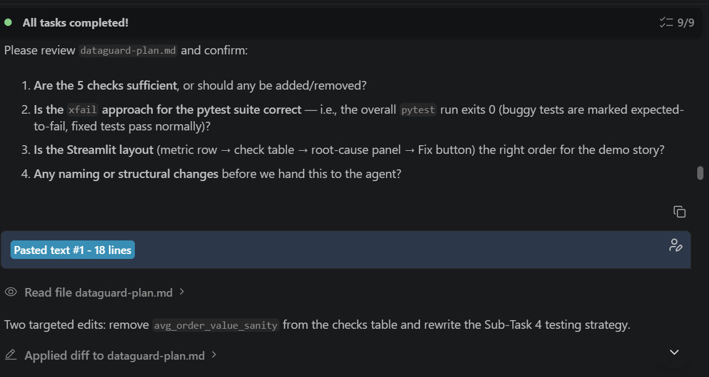
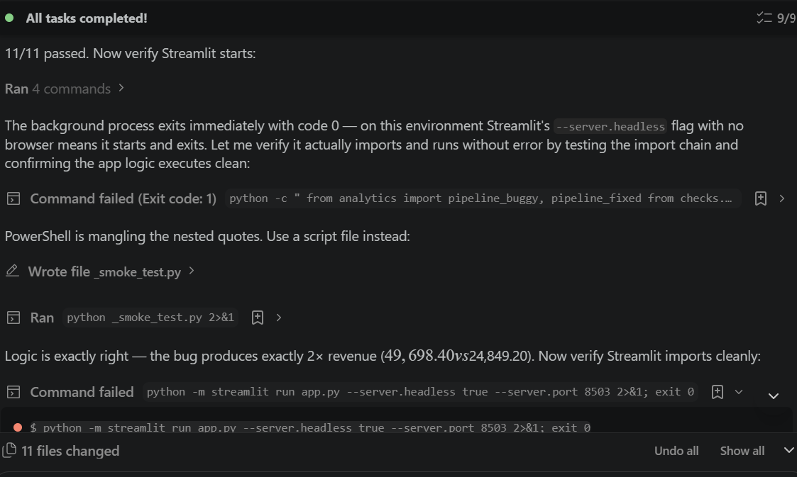
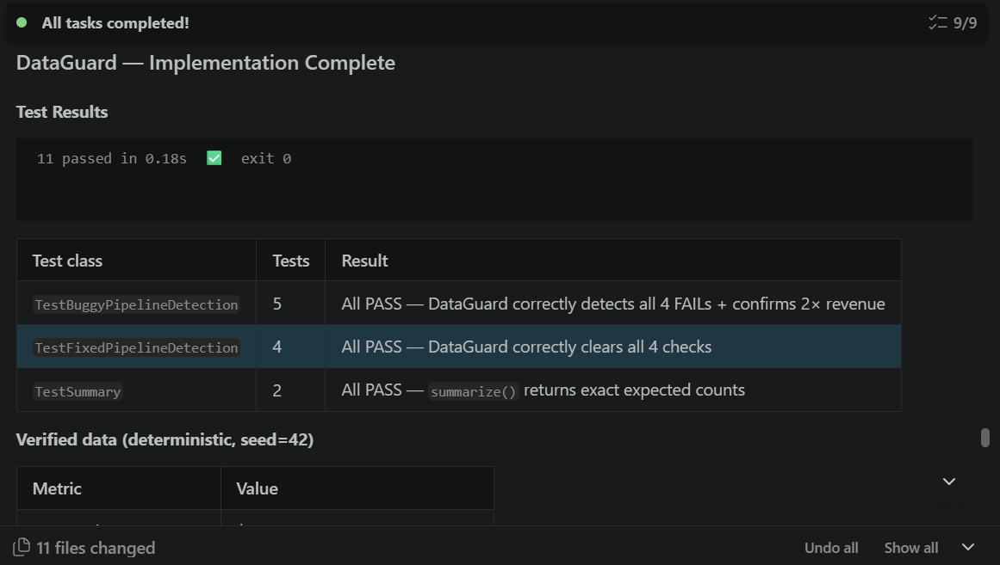

# 🛡️ DataGuard — Analytics Regression Detector

> **Catch silent analytics regressions before incorrect metrics reach dashboards and business decisions.**

DataGuard is a lightweight developer tool that validates **business-metric correctness** in analytics pipelines.

Analytics code can execute successfully without raising an exception — while still producing completely wrong KPIs. DataGuard demonstrates how automated regression guards can detect those silent failures, explain the evidence behind them, and verify that a corrected pipeline restores the expected results.

🌐 **Live Demo:** https://dataguard-analytics.streamlit.app

---

## The Problem

A data pipeline does not need to crash to be wrong.

Changes to joins, aggregations, filters, or transformations can silently alter important business metrics while the code continues to execute successfully.

For example:

```text
Expected Revenue:   $24,849.20
Reported Revenue:   $49,698.40
Runtime Errors:     0
Revenue Deviation:  +100.0%
```

From a software-execution perspective, the pipeline works.

From a business perspective, the result is wrong.

DataGuard is designed to catch this type of analytics regression before the metric reaches a dashboard, report, or downstream decision.

---

## Demo Scenario

The prototype uses a deterministic synthetic e-commerce dataset containing:

- 100 orders
- 200 order-item rows
- Exactly 2 line items per order
- Reproducible data generation using a fixed random seed

The intentionally buggy analytics pipeline joins order-level data with order-item data:

```text
orders
   │
   │ join on order_id
   ▼
order_items
   │
   ▼
200 joined rows
```

Because every order has two line items, each order-level revenue value appears twice after the join.

The buggy pipeline then sums `order_total` from the joined result.

The code runs successfully — but revenue is doubled.

---

## Regression Detected ❌

DataGuard compares the pipeline output against deterministic business expectations.

| Metric | Expected | Buggy Pipeline |
|---|---:|---:|
| Revenue | $24,849.20 | $49,698.40 |
| Revenue deviation | < 1.0% | +100.0% |
| Order count | 100 | 200 |
| Checks passed | 4 expected | 0 / 4 |

DataGuard detects four failures:

```text
🔴 revenue_accuracy
🔴 duplicate_order_rows
🔴 revenue_deviation_pct
🔴 order_count_match
```

### Root Cause

DataGuard surfaces the evidence behind the regression:

```text
100 orders
     ↓
Join with 200 order-item rows
     ↓
200 resulting rows
     ↓
Each order_total appears twice
     ↓
Revenue is double-counted
```

The problem is therefore not a runtime failure.

It is a **business-metric regression caused by incorrect aggregation after a one-to-many join**.

---

## Corrected Pipeline ✅

The corrected implementation aggregates revenue directly from the order-level dataset instead of summing duplicated order totals after the join.

After applying the fix:

| Metric | Expected | Fixed Pipeline |
|---|---:|---:|
| Revenue | $24,849.20 | $24,849.20 |
| Revenue deviation | 0.0% | 0.0% |
| Order count | 100 | 100 |
| Checks passed | 4 | 4 / 4 |

Result:

```text
BEFORE
$24,849.20 expected
$49,698.40 actual
+100.0% deviation
0/4 checks passed
        │
        ▼
  Root cause detected
        │
        ▼
   Pipeline corrected
        │
        ▼
AFTER
$24,849.20 expected
$24,849.20 actual
0.0% deviation
4/4 checks passed
```

---

## Developer Workflow

DataGuard demonstrates a simple analytics validation workflow:

```text
Analytics Code Change
        │
        ▼
Run DataGuard
        │
        ▼
Business-Metric Checks
        │
        ▼
Regression Detected?
      /       \
    YES        NO
     │          │
     ▼          ▼
Evidence      PASS
     │
     ▼
Root Cause
     │
     ▼
Fix Pipeline
     │
     ▼
Validate Again
     │
     ▼
    PASS
```

The goal is to move business-metric validation closer to the development process rather than discovering incorrect KPIs after they reach production dashboards.

---

## Regression Guards

The MVP implements four deterministic guards.

### 1. Revenue Accuracy

Compares reported revenue with the expected order-level revenue.

### 2. Duplicate Order Rows

Detects row multiplication introduced by the analytics pipeline.

### 3. Revenue Deviation

Calculates percentage deviation between expected and reported revenue.

### 4. Order Count Consistency

Checks whether the pipeline preserves the expected number of orders.

Together, these checks provide both **detection** and **evidence** for the regression.

---

## Automated Testing

DataGuard includes a pytest suite covering both the intentionally buggy pipeline and the corrected implementation.

```bash
python -m pytest -v
```

Final test result:

```text
11 passed
```

The tests verify that:

- DataGuard detects the buggy pipeline
- The duplicated join produces the expected regression
- Revenue is exactly doubled in the demo scenario
- All four guards fail when the regression is active
- The corrected pipeline restores expected revenue
- The corrected order count is preserved
- All four guards pass after the fix

Importantly, the buggy pipeline is intentional.

The tests do not treat the bug itself as an expected pytest failure. Instead, they positively verify that **DataGuard correctly detects the regression**.

---

## Architecture

```text
dataguard-analytics-regression-detector/
│
├── analytics/
│   ├── pipeline_buggy.py
│   └── pipeline_fixed.py
│
├── checks/
│   └── guards.py
│
├── data/
│   ├── seed.py
│   ├── orders.csv
│   └── order_items.csv
│
├── tests/
│   ├── conftest.py
│   └── test_guards.py
│
├── bob_sessions/
│   ├── 01-planning-with-bob.png
│   ├── 02-implementation-testing.png
│   ├── 03-task-completed.png
│   └── README.md
│
├── app.py
├── dataguard-plan.md
├── bob-task-session-dataguard.md
├── requirements.txt
└── README.md
```

### Main Components

**`data/seed.py`**

Generates the deterministic synthetic e-commerce dataset.

**`analytics/pipeline_buggy.py`**

Contains the intentionally incorrect join and aggregation logic.

**`analytics/pipeline_fixed.py`**

Contains the corrected analytics implementation.

**`checks/guards.py`**

Runs the business-metric regression checks and produces validation evidence.

**`tests/test_guards.py`**

Validates regression detection and corrected-pipeline behavior.

**`app.py`**

Provides the interactive Streamlit demonstration.

---

## Built with IBM Bob 2.0

IBM Bob 2.0 was used as the AI-assisted development environment for the project.

The development workflow included:

```text
Problem Definition
      ↓
IBM Bob Planning
      ↓
Architecture & Regression Design
      ↓
Implementation
      ↓
Automated Testing
      ↓
Debugging
      ↓
Application Verification
```

During planning, the proposed architecture and testing strategy were reviewed and refined before implementation.

IBM Bob was then used to assist with:

- MVP planning
- Project architecture
- Python implementation
- Regression-guard implementation
- pytest test generation
- Test execution
- Debugging
- Streamlit application verification

The final automated test suite completed with:

```text
11 passed
```

Development evidence is available in:

```text
bob_sessions/
bob-task-session-dataguard.md
dataguard-plan.md
```

These files document the planning, implementation, testing, and completion workflow.

---

### IBM Bob Development Evidence

#### 1. Planning with IBM Bob

IBM Bob was used to turn the initial DataGuard concept into a structured implementation plan covering the dataset, analytics pipelines, regression guards, automated testing, and Streamlit demo.



#### 2. Implementation & Testing

IBM Bob assisted with implementing the approved architecture and running the automated validation workflow.



#### 3. Task Completion

The completed implementation passed the full automated test suite:

**11 tests passed.**



## Tech Stack

| Technology | Purpose |
|---|---|
| Python | Core implementation |
| pandas | Data processing and analytics |
| pytest | Automated regression testing |
| Streamlit | Interactive demo application |
| IBM Bob 2.0 | AI-assisted planning, implementation, testing, and debugging |

---

## Run Locally

### 1. Clone the repository

```bash
git clone https://github.com/nina-ng-labs/dataguard-analytics-regression-detector.git
cd dataguard-analytics-regression-detector
```

### 2. Install dependencies

```bash
pip install -r requirements.txt
```

### 3. Run the tests

```bash
python -m pytest -v
```

Expected result:

```text
11 passed
```

### 4. Start DataGuard

```bash
streamlit run app.py
```

The application initially loads the intentionally buggy pipeline so the regression can be inspected.

Click:

```text
Fix Bug — switch to correct pipeline
```

to run the corrected implementation and observe:

```text
0/4 PASS → 4/4 PASS
+100.0% deviation → 0.0%
```

---

## Live Demo

Try DataGuard here:

**https://dataguard-analytics.streamlit.app**

The demo is intentionally deterministic so the regression and its correction can be reproduced consistently.

---

## Why This Project

Data quality problems are not always missing values or malformed records.

Some of the most dangerous failures happen when technically valid code produces **plausible but incorrect business metrics**.

DataGuard explores how analytics engineering workflows can incorporate business-level regression checks alongside conventional software tests.

The current MVP focuses on one deterministic duplicate-join scenario, but the same approach can be extended to guards for:

- unexpected KPI movements
- aggregation changes
- row-count anomalies
- join-cardinality changes
- missing dimensions
- schema changes
- historical metric regressions

---

## Project Status

**MVP complete**

- ✅ Deterministic analytics regression scenario
- ✅ Business-metric regression guards
- ✅ Root-cause evidence
- ✅ Buggy and corrected pipelines
- ✅ Automated pytest coverage
- ✅ 11 tests passing
- ✅ Interactive Streamlit demo
- ✅ Public deployment
- ✅ IBM Bob development evidence

---

## Author

Built as a hands-on project exploring **analytics engineering, data quality, automated testing, and AI-assisted software development**.
